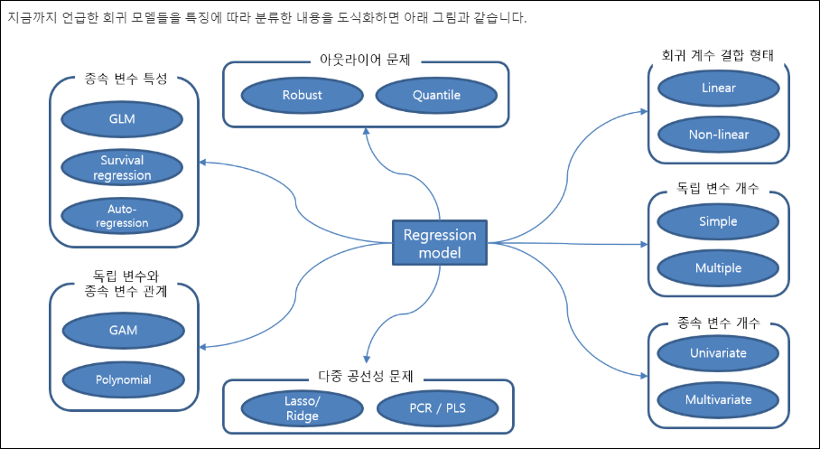
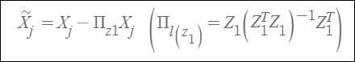

# PLS-DA (Partial Least Squares Discriminant Analysis)

## 회귀 모델들의 특징에 따른 분류
> PLS-DA에 대해 알아보기 전 기본적인 회귀모델에는 어떤것이 있는지...

   

   

## 기타

   

## PCA (Principle Component Analysis)(주성분분석)
> PLS와 항상 비교되는 PCA에 대해 먼저 알아보자

- 다변량 분석기법
- '주성분'이라고 불리는 선형조합으로 표현하는 기법
- 여기서 주성분은 공분산(XTX)로부터 eigenvector와 eigenvalue를 도출하여 계산됨

### 주성분간의 수직관계
- 1st 주성분(PC1): 독립변수들의 변동(분산)을 가장 많이 설명하는 성분
- 2st 주성분(PC2): PC1과 수직인 주성분

### 차원축소 & 예측력 향상
- 상관계수가 높을수록 주성분 분석하기 좋다

### 특징
- 독립변수들의 차원을 줄이기위해 사용가능, 주성분을 이용하여 타겟변수(Y)의 설명력(예측력)을 높일 수 있다.
- 독립변수들의 전체분산을 가장 잘 설명해주는 component를 사용하여 독립변수들간 다중공선성 문제를 해결가능
- 주요 component score들이 Y의 예측력을 보장하는 것은 아니다.
- 주요 component score는 X의 분산을 가장 잘 설명하는 방향의 축을 기준으로 변환된 것이기 떄문에 Y와 관계에 있어서는 상관성이 없을수 있다.

---
## PCR (Principal Component Regression)
- 독립 변수들의 주성분(Principal Component)들을 추출한 후 이 주성분들을 이용해서 회귀 모델을 만드는 기법
  - 즉 PCA + Multiple linear regression
- 주성분들은 서로 직교하기 떄문에 다중공선성이 발생하지 않음
  - 안심하고 다중 선형 회귀 모델을 만들 수 있음
- PCA를 이용해서 변환한 주성분 변수들 중에서 상위 몇개의 변수만 이용할 경우 lasso 처럼 일종의 regularization 효과를 줄 수 있어 모델의 overfitting 현상도 완화시킬 수 있음
- [BUT!] 각각의 주성분 변수들은 실제 독립변수들의 전체 영향력을 부분적으로 반영한 변수들이기 떄문에...
  -  이 회귀 모델을 이용해서는 각 조건의 영향력(Y에 대한)을 파악하기가 거의 불가능해지는 문제점 있음
  -  모델해석 불가,,, 따라서 실제로 PCR은 잘 사용하지 않음
---

## PLS (Partial Least Squares)
> PLS-DA 를 알아보기전 기본이 되는 PLS가 무엇인지 먼저 알아 보겠음

### What is PLS?
- PCA와 유사하지만 데이터의 분산만을 잡으려는 PCA와 달리 Y값까지 고려해 orthogonal한 새로운 feature와 response들을 X,Y로 부터 만들고, 이로부터 수행하는 linear regression
    - 데이터에 비해 변수가 많을때 OLS(Ordinary Least Square)에 비해 유용함
- PCR(Principal Component Regression)은 X 변수들의 분산량을 가장 많이 포함하는 선형결합으로 회귀 모형을 적합함
- 여기서 주성분(PC)은 비지도 방법으로 정의됨
  - X 변수들을 정말로 잘 보여줄(설명할) 수 있는 방향인지에 대한 확실한 증거가 없음(drawback)
- 이의 대안으로 PLS 알고리즘이 제안됨
- PLS는 주성분처럼 원래 X 변수의 선형결합인 새 변수들을 정의하되, Y를 고려하여 지도 방법으로 새 변수를 만든다. 
- 즉, X와 Y 모두를 잘 설명할 수 있는 방향을 고려함

### PLS Regression (최소자승회귀법)
- PCR 과 기본 개념은 비슷하지만 변수들의 변환 방식이 다름
  - PCR: 독립 변수의 분산을 최대로 하는 축을 찾아 데이터를 전사(projection)하는 방식으로 독립변수'만' 변형
  - PLS: 종속 변수와 독립 변수의 관계를 가장 잘 설명하는 축을 찾아 전사하는 방식으로 종속, 독립 변수를 모두 변형
- 주성분분석의 component와 최소자승회귀법의 component의 비교
- PLS 는 공정변수들의 변동을 설명하는 벡터 t 를 구하는데 X의 정보만을 이용하는 것이 아니라 타겟변수 Y의 정보를 동시에 고려함

### How?
1. p개 변수를 표준화 함
2. 새 변수를 정의함. 여기서 계수 값은 y와 Xj의 단순 회귀 모형을 적합한 회귀계수이다
   
   

3. Projection으로 Xj 에서 Z1이 설명하는 효과를 제거

   

4. 구해진 남은 Xj(tilda)에서 다시 단순회귀모형을 적합한 회귀계수와 X의 선형결합으로 새 변수를 정의
5. 3을 반복하고 다시 회귀계수를 적합하고,,, 반복함

- PLS 에서도 고려한 변수 수 M은 tuning parameter이며 CV로 결정될 수 있다.

### Advantages

   

### 고려사항

   

### 추가 참고자료
- [PLS-DA]('https://mixomicsteam.github.io/Bookdown/plsda.html')
- [PLS Overview]('file:///C:/Users/tjdwo/Downloads/SSRN-id1631359.pdf')
- [PLS-DA Youtube]('https://www.youtube.com/watch?v=HnmS51Q_LsE')
- [PLS 관련 글(블로그)]('https://blog.naver.com/jinwon_hong/140054841103')]
- 