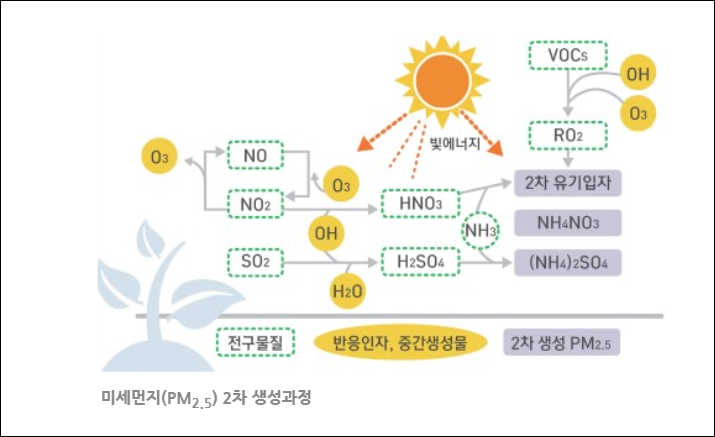
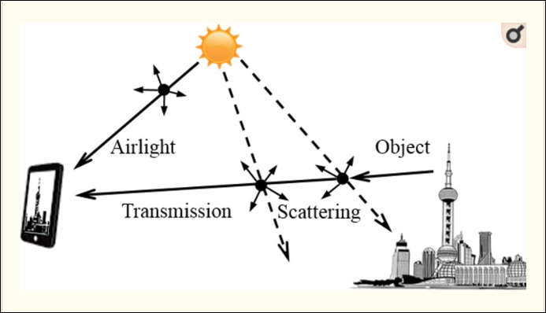

# 미세먼지(Particulate Matter), 도데체 뭘까?

## 미세먼지의 개념

### 먼지와 미세먼지
- 먼지: 대기중에 떠다니거나 흩날려 내려오는 입자상 물질
    - 입자 크기에 따라 50um 이하인 총먼지 (TPS, Total Suspended Particles)와 입자크기가 매우 작은 미세먼지 (PM, Particulate Matter)로 구분
    - 미세먼지는 다시 지름이 10um 보다 작은 미세먼지(PM10)와 지름이 2.5um보다 작은 초미세먼지(PM2.5)로 나뉨

---

### 미세먼지의 성분
- 미세먼지의 성분은 미세먼지의 발생 지역, 계절, 기상조건 등에 따라 달라짐
- 일반적으로는 
  - 황산염, 질산염: 대기 오염물질이 공기 중에서 반응하여 형성된 덩어리와
  - 탄소류와 검댕: 석탄/석유 등 화석연료를 태우는 과정에서 발생하는,
  - 광물: 지표면 흙먼지 등에서 생기는 

---

## 미세먼지 발생원
> 자연적인 것과 인위적인 것으로 구분됨

### 자연적 VS 인위적
- 자연적: 흙먼지, 바닷물에서 생기는 소금, 식물의 꽃가루 등

- 인위적: 
  - 보일러나 발전시설 등에서 석탄/석유 등 화석연료를 태울 떄 생기는 매연, 
  - 자동차 배기가스, 
  - 건설현장 등에서 발생하는 날림먼지, 
  - 공장 내 분말형태의 원자재, 
  - 부자재 취급공정에서의 가루성분, 소각장 연기 등
  
---

### 1차 발생원 VS 2차 발생원
- 1차 발생원:
  - 굴뚝 등 발생원에서부터 고체 상태의 미세먼지로 나오는 경우   
  
      

- 2차 발생원: 
  - 발생원에서는 가스 상태로 나온 물질이 공기 중의 다른 물질과 화확반응을 일으켜 메시먼지가 되는 경우
  - 석탄/석유 등 화석연료가 연소되는 과정에서 배출되는 황산화물이 대기중의 수증기, 암모니아와 결합
  - 자동차 배기가스에서 나오는 질소산화물이 대기 중의 수증기, 오전, 암모니아 등과 결합
  - 수도권에서의 화확반응에 의한 2차 생성비중이 전체 초미세먼지(PM2.5) 발생량의 2/3를 차지

      
      

### 대기오염물질을 많이 배출하는 업종
- 발전업
- 제철업
- 시멘트업 등
- 대기오염물질 방출 상위 10개 업체: 발전업 5개, 제철업 3개, 시멘트업 2개
  
---

### 미세먼지 배출량
- 배출량이 가장 많은 배출원은 제조업의 연소공정과 자동차를 비롯한 이동오염원
  
      

- 이동오염원에서 나오는 미세먼지의 대부분이 PM2.5로 그 비중이 92%에 달함
  - 화물차와 RV차량에서 대부분이 배출
  - 비도로이동오염원의 경우 선박과 건설장비 등이 존재
  
      
  
- 날림먼지:
  - 일정한 배출구 없이 대기로 흩날리는 미세먼지
  - 통계에는 포함되어 있지 않지만 매우 많은 발생량(배출량)을 가짐 (약 18,168톤의 PM2.5) (도로 배출량이 11,932톤)

- 조리/요리 중 발생

    

### 배출량 통계의 문제점
> 배출원 누락, 배출계수의 부정확성, 노후화된 시스템 등으로 인한 배출량 통계의 부정확성

- 배출원 누락: 배출량이 실제보다 적게 산정됨
- 배출계수의 부정확성: 이미 산정된 자료 또한 실제 배출량과는 다를 수 있음
- 대표적으로 누락 및 과소 산정 배출원은 불법 노천소각, 농업잔재물 소각, 고기 구이, 숯가마, 사업장의 개방된 생산공정 시설, 자연발생 흙먼지나 VOCs 등이 있으며, 이들은 배출형태가 일정하지 않거나 지역적, 시간적으로 불규칙한 특정이 있고 은밀하게 이루어지는 사례가 많아 정확한 배출량 산정이 매우 어려운 특징이 있음

### 개선방안
- 누락 배출원 발굴
- 기존 배출원 보완
- 시스템 개선: 산정방법 개선, 검증방법 개발, 차세대 배출량 산정시스템 구축 등

---  

## 미세먼지의 측정, 측정방법
> 국제적으로 통용되는 미세먼지 측정농도 단위는 ㎍/㎥로 '마이크로그램 퍼 세제곱미터' 라고 읽음
>> 1㎥의 공기 안에 있는 미세먼지의 중량(㎍이란 g의 백만분의 1에 해당하는 단위)을 의미

### 베타선 흡수법, 광산란법
- 방사선 또는 빛의 물리적 특성을 이용하여 간접적으로 측정하는 법

   
 

### 중량농도법
- 미세먼지의 질량을 저울로 직접(수동) 측정하는 법

     
 

### 환경위성
> 환경위성은 햇빛의 특정 파장에 반응하는 요염물질의 특성을 이용하여 미세먼지 농도 측정

- 정지궤도 환경위성은 36,000km 상공에서 지구로부터 반사된 '태양복사에너지'를 '광학센서'로 측정하여 대기오염물질 및 기후변화 유발물질의 농도 관측
  - 측정항목: SO2, NO2, HCHO, O3, Aerosol

- 대기의 '수직농도'로부터 지상의 미세먼지 정보를 추출하는 방법 개발 중

     

---

## 기상과의 관계

### 기온역전
- 대기중 기온은 일반적으로 고도가 100m 높아질 때마다 약 0.6도 씩 낮아짐
- 그러나 반대로 고도가 높아질수록 기온이 올라가는 현상 = 기온역전
- 주로 일교차가 큰 계절이나 산간 분지지역에서 발생

      

- 기온역전 발생시, 고도가 낮은 쪽에 무거운 공기가, 높은 쪽에 가벼운 공기가 위치
  - 무게 차에 의한 공기의 상하이동이 일어나지 않음
  - 지상에서 발생하는 미세먼지 등 대기오염 물질이 지상층에 모무르게 됨
  - 미세먼지 농도 상승!

### 기후변화
> 최근 기후변화, 지구 온난화 등의 이유로 미세먼지 농도가 악화됨

- 동아시아지역의 대기흐름이 정체되어 농도 악화
- 지구 온난화로 극지방의 빙하가 녹으며 극지방과 유라시아 대륙의 온도차가 감소
  - 유라시아 대륙의 풍속 감소, 대기 정체 유발 --> 고농도 미세먼지 발생 빈도 증가
  
   

### 미세먼지와 가시거리
- PM2.5의 농도가 높아지면 빛이 미세먼지에 의해 여러 방향으로 흩어지거나 미세먼지에 흡수되어 가시거리가 감소
- 황산염, 질산염 등 대기오염 농도가 높은 상태에서 습도까지 높아지면 대기오염물질이 수분을 흡수하여 2차적 미세먼지 발생 = 가시거리 감소

   
   

  
### 계절별 농도 변화
- 봄: 이동성 저기압과 건조한 지표면의 영향으로 황사를 동반한 고농도 미세먼지 발생 가능성이 큼
- 여름: 많은 비가 내리며 미세먼지와 같은 대기오염물질이 빗방울에 씻겨 제거됨으로 대체적으로 맑음
- 가을: 다른 계절에 비해 기압계의 흐름이 빠르고 지역적인 대기의 순환이 원활하여 대체적으로 맑음
- 겨울: 난방 등 연료사용이 증가하여 대체적으로 농도가 높아질 수 있음

      
      

## 미세먼지 예보, 정보 획득처

### Air Korea(에어코리아)
- ['AirKorea'](http://www.airkorea.or.kr/web) 사이트 접속
  
   
  
   

### 각종 미세먼지 관련 어플
- 미세찰칵(딥비전스): 사진/이미지 인식을 통한 미세먼지 농도 측정

### 기상예보 VS 실제 주변 농도
> 각종 정보처에서 제공되는 미세먼지 농도와 실제 우리 주변의 미세먼지 농도에는 차이가 있는데 왜 그런가?

- 미세먼지 예보는 일평균 농도가 기준
  - 일반적으로 일평균 농도를 기준으로 삼고 있음
- 고농도 미세먼지의 경우, 발생 시점과 지속 시간을 예측하기 어려움
- 미세먼지 예보는 시시각각 변하는 기상상태와 배출량을 복합적으로 다루기 떄문에 농도 예측에 변수가 많음
- 미세먼지 예보 정확도의 수준은 약 80프로 정도라고 함
  
      

### 미세먼지 예보정확도 평가
> 미세먼지 예보정확도는 전체 정확도와 고농도 정확도로 구분하여 평가

> 관측된 일평균 농도와 예보된 등급의 구간 농도가 일치하면 '적중'으로 판단

- 전체 정확도: 예보횟수 대비 적중횟수의 비율
  
      

- 고농도 정확도: 일평균 농도가 예보등급 '나쁨' 이상일 때 적용
  - 관측 값 기준으로 '나쁨' 이상 등급시의 총 예보횟수 대비 적중횟수의 비율

      

## 미세먼지와 건강

### 인체에 미치는 영향
> 미세먼지는, 천식, 호흡기 질환, 심혈관 질환 등의 원인

- 미세먼지 입자는 매우작아 코나 기관지에서 걸러지지 않고 몸속에 스며들 가능성이 높음
- 폐까지 침투한 미세먼지는 천식과 폐질환의 원인
  - 이를 제거하기 위한 면역세포의 작용으로 염증을 일으킴
- 1군 발암물질로 분류됨

   
